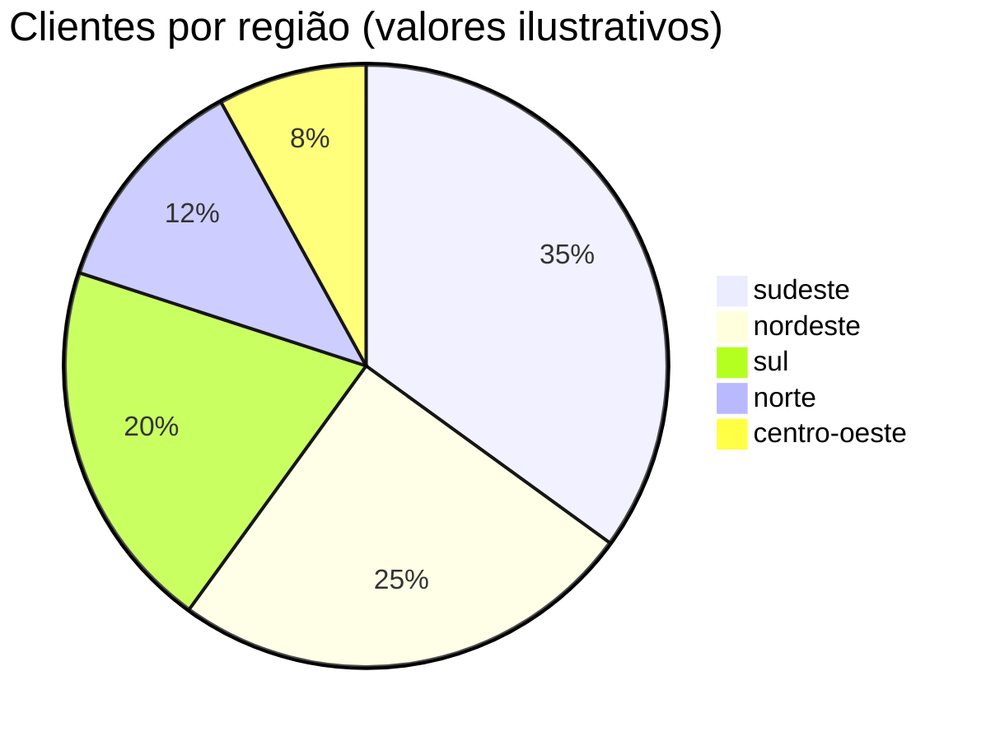

### Glossário (conteúdo vindo de `docs_includes/glossario.md`)

Este trecho **não está** na docstring de `docs_demo.py`: ele vive num arquivo
markdown separado e é incluído na documentação pela diretiva `.. include::` —
útil para compartilhar conteúdo entre docstrings e outros documentos (um
`README.md`, por exemplo) sem duplicar texto.

| Termo             | Definição                                                        |
|-------------------|------------------------------------------------------------------|
| *partição*        | subdiretório de um dataset (`order_month=01/`) que permite pruning |
| *partition pruning* | pular a leitura de partições que o filtro da consulta descarta  |
| *spill*           | derramar dados intermediários para disco quando a RAM não basta   |
| *zero-copy*       | passar dados entre camadas sem duplicar os buffers de memória     |

Marcadores de markdown funcionam normalmente aqui dentro:

- **negrito**, *itálico* e `código inline`;
- listas e sub-listas;
- e até mermaid, se o arquivo for incluído com `--mermaid` habilitado:

